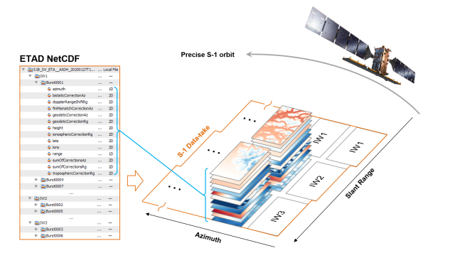

# s1-etad-apply

Download and apply the extended time annotation dataset (ETAD) product to a sentinel-1 SLC. 

This notebook fills a gap to demonstrate the complete process of downloading all required files and applying the ETAD product to generate a corrected Sentinel-1 SLC product.

  

# ETAD

  

The Extended Timing Annotation Dataset (ETAD) for Copernicus Sentinel-1 is a new auxiliary product developed by ESA (with DLR as contractor), providing users with corrections to improve geometric accuracy of Sentinel-1 SLC images to centimetric levels. For more information see - https://sentinels.copernicus.eu/web/sentinel/missions/sentinel-1/data-products/etad-dataset.

  

*ETAD NetCDF structure. Each product covers a complete Sentinel-1 data-take following the SLC product structure. The correction layers are regularly sampled 2-D grids with approximately 200 m resolution that are grouped at burst level. Credit ESA (https://sentinels.copernicus.eu/web/sentinel/missions/sentinel-1/data-products/etad-dataset)*
  

# Credentials

  

The ETAD.ipynb notebook demonstrates how to download and apply an ETAD product to a sentinel-1 SLC. Two sets of credentials are required and should be set in the notebook:

1) Earthdata credentials - https://urs.earthdata.nasa.gov/users/new

2) Copernicus dataspace credentials - https://dataspace.copernicus.eu/

  

# Usage

  

- A package management tool such as mamba (recommended) or anaconda is required

- ``conda env create -f environment.yaml``

- Run the ETAD.ipynb notebook